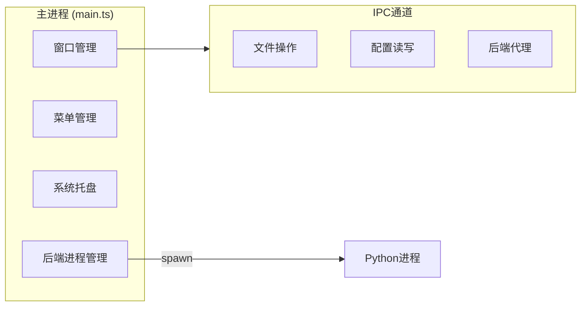
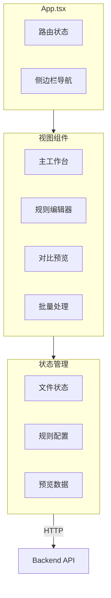
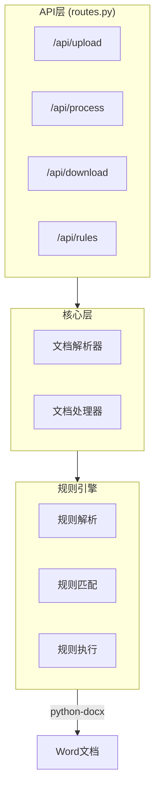
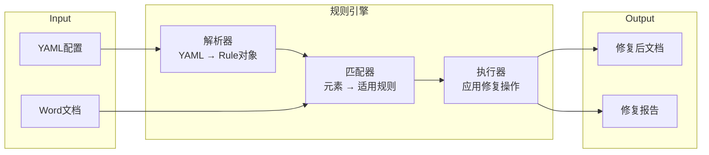
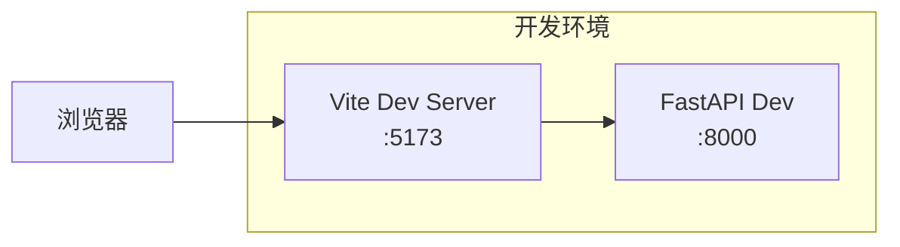
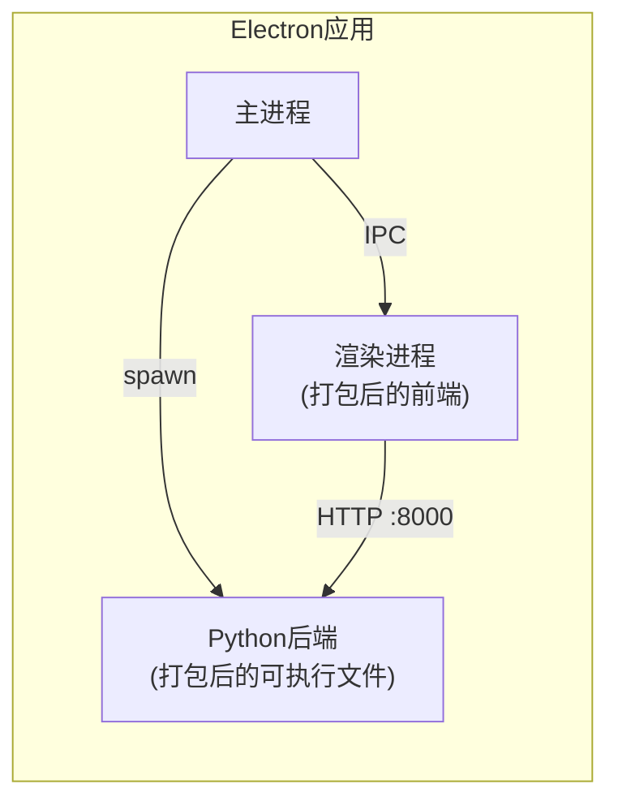

# 架构文档

本文档详细阐述 **Md2Docx - Word文档格式自动修复工具** 的技术架构、设计模式和实现细节。

> [!NOTE]
> 本文档是 [**设计文档 (DESIGN_DOC.md)**](./DESIGN_DOC.md) 的具体化和深化。在阅读本文档前，请确保您已理解项目的高阶目标和设计。

---

## 1. 核心设计原则

| 原则         | 说明                   | 实践                     |
| :----------- | :--------------------- | :----------------------- |
| **模块化**   | 每个组件高内聚、低耦合 | 前后端分离，规则引擎独立 |
| **可测试性** | 所有核心逻辑有测试覆盖 | 依赖注入，Mock友好       |
| **可扩展性** | 架构支持平滑功能扩展   | 规则插件化，API版本化    |
| **离线优先** | 无需网络即可使用       | 本地后端服务，资源内置   |
| **用户友好** | 操作简单，反馈及时     | 实时预览，进度可视化     |

---

## 2. 目录结构说明

```
md2docx/
│
├── frontend/                     # React 前端应用
│   ├── src/
│   │   ├── app/
│   │   │   ├── components/       # 业务组件
│   │   │   │   ├── Workspace.tsx         # 主工作台
│   │   │   │   ├── RuleEditor.tsx        # 规则编辑器
│   │   │   │   ├── ComparisonPreview.tsx # 对比预览
│   │   │   │   ├── BatchProcessing.tsx   # 批量处理
│   │   │   │   └── ui/                   # 基础UI组件 (48个)
│   │   │   └── App.tsx           # 应用入口和路由
│   │   ├── styles/               # 全局样式
│   │   └── main.tsx              # React入口
│   ├── package.json
│   └── vite.config.ts
│
├── electron/                     # [待创建] Electron主进程
│   ├── main.ts                   # 主进程入口
│   ├── preload.ts                # 预加载脚本
│   └── ipc/                      # IPC处理器
│
├── backend/                      # [待创建] Python后端
│   ├── api/                      # FastAPI路由
│   │   ├── __init__.py
│   │   ├── routes.py             # 路由定义
│   │   └── schemas.py            # Pydantic模型
│   ├── core/                     # 核心业务逻辑
│   │   ├── __init__.py
│   │   ├── document.py           # 文档解析器
│   │   └── processor.py          # 文档处理器
│   ├── engine/                   # 规则引擎
│   │   ├── __init__.py
│   │   ├── parser.py             # 规则解析
│   │   ├── matcher.py            # 规则匹配
│   │   └── executor.py           # 规则执行
│   ├── rules/                    # 内置规则
│   │   ├── tables.yaml           # 表格规则
│   │   ├── formulas.yaml         # 公式规则
│   │   └── typography.yaml       # 排版规则
│   └── main.py                   # FastAPI入口
│
├── docs/                         # 详细文档
│   ├── adr/                      # 架构决策记录
│   ├── FRONTEND.md               # 前端架构
│   ├── BACKEND.md                # 后端架构
│   ├── RULE_ENGINE.md            # 规则引擎
│   ├── API.md                    # API接口
│   ├── DEVELOPMENT.md            # 开发指南
│   └── FEATURES.md               # 功能清单
│
├── presets/                      # [待创建] 预设配置
│   ├── corporate.yaml            # 企业标准
│   ├── academic.yaml             # 学术论文
│   └── blog.yaml                 # 技术博客
│
├── tests/                        # [待创建] 测试代码
│   ├── test_api.py
│   ├── test_engine.py
│   └── fixtures/                 # 测试文档
│
├── main.py                       # Python后端入口 (当前)
├── ARCHITECTURE.md               # 本文件
├── DESIGN_DOC.md                 # 设计文档
├── CONTRIBUTING.md               # 贡献指南
├── CODE_OF_CONDUCT.md            # 行为准则
├── LICENSE                       # 许可证
└── README.md                     # 项目主页
```

---

## 3. 关键组件详解

### 3.1 Electron主进程



**职责**：

- 创建和管理应用窗口
- 管理应用菜单和系统托盘
- 启动和监控Python后端进程
- 处理文件系统操作IPC请求

**关键设计决策**：

- 后端进程随应用启动，随应用关闭而终止
- 使用 `child_process.spawn` 启动Python进程
- 通过HTTP与Python后端通信，避免IPC复杂性

### 3.2 React渲染进程



**技术细节**：

- **状态管理**：使用React内置状态 + Context，复杂场景可升级到Zustand
- **API调用**：封装统一的HTTP客户端，处理错误和加载状态
- **UI组件**：基于Radix UI的无障碍组件库，Tailwind CSS样式

**核心组件说明**：

| 组件                | 文件                  | 职责                              |
| :------------------ | :-------------------- | :-------------------------------- |
| `Workspace`         | Workspace.tsx         | 文件上传、预设选择、启动修复      |
| `RuleEditor`        | RuleEditor.tsx        | 规则树管理、YAML编辑、规则测试    |
| `ComparisonPreview` | ComparisonPreview.tsx | 原始/修复对比、手动微调、确认下载 |
| `BatchProcessing`   | BatchProcessing.tsx   | 文件列表、进度监控、批量操作      |

### 3.3 FastAPI后端服务



**职责**：

- 接收前端文件上传请求
- 调用规则引擎处理文档
- 返回预览数据和修复后文件
- 管理规则配置的CRUD

**技术要点**：

- 使用Pydantic进行请求/响应数据验证
- 异步处理大文件操作
- 统一的错误处理和日志记录

### 3.4 规则引擎核心



**规则类型**：

| 类型     | 目标元素   | 修复操作示例                   |
| :------- | :--------- | :----------------------------- |
| 表格规则 | `<w:tbl>`  | 边框样式、单元格间距、表头格式 |
| 公式规则 | LaTeX/OMML | 公式转换、编号处理、对齐方式   |
| 排版规则 | 段落/标题  | 字体大小、行间距、首行缩进     |
| 图表规则 | 图片/图表  | 尺寸调整、标题添加、居中对齐   |

**执行流程**：

1. **解析阶段**：加载YAML配置，构建规则对象树
2. **匹配阶段**：遍历文档元素，找出适用的规则
3. **执行阶段**：按优先级执行规则，生成修复操作
4. **验证阶段**：检查修复结果的完整性

---

## 4. 数据模型

### 4.1 文档模型

```python
# 文档结构的内部表示
class Document:
    id: str                    # 文档唯一标识
    name: str                  # 文件名
    path: str                  # 文件路径
    elements: List[Element]    # 文档元素列表
    metadata: DocumentMeta     # 文档元数据

class Element:
    id: str                    # 元素唯一标识
    type: ElementType          # 元素类型 (table/paragraph/image/...)
    content: Any               # 元素内容
    style: Dict[str, Any]      # 样式属性
    position: Position         # 在文档中的位置
```

### 4.2 规则模型

```python
# 规则配置的内部表示
class Rule:
    id: str                    # 规则唯一标识
    name: str                  # 规则名称
    category: str              # 规则分类
    priority: int              # 优先级 (数字越小优先级越高)
    enabled: bool              # 是否启用
    selector: Selector         # 元素选择器
    actions: List[Action]      # 修复操作列表

class Selector:
    type: str                  # 选择器类型 (type/style/content)
    conditions: List[Dict]     # 匹配条件

class Action:
    type: str                  # 操作类型 (set_style/add_content/...)
    params: Dict[str, Any]     # 操作参数
```

### 4.3 修复报告模型

```python
class FixReport:
    document_id: str           # 文档标识
    total_fixes: int           # 修复总数
    fixes: List[Fix]           # 修复列表
    errors: List[Error]        # 错误列表
    duration_ms: int           # 处理耗时

class Fix:
    rule_id: str               # 应用的规则
    element_id: str            # 修复的元素
    before: Any                # 修复前状态
    after: Any                 # 修复后状态
    description: str           # 修复说明
```

---

## 5. API设计概述

### 5.1 RESTful端点

| 方法   | 端点                 | 说明               |
| :----- | :------------------- | :----------------- |
| `POST` | `/api/upload`        | 上传文档文件       |
| `POST` | `/api/process`       | 处理文档并返回预览 |
| `GET`  | `/api/download/{id}` | 下载修复后的文档   |
| `GET`  | `/api/rules`         | 获取规则列表       |
| `PUT`  | `/api/rules/{id}`    | 更新规则配置       |
| `POST` | `/api/rules/test`    | 测试规则效果       |

> [!TIP]
> 完整的API文档请参阅 [docs/API.md](./docs/API.md)

### 5.2 IPC通道

| 通道             | 方向            | 说明               |
| :--------------- | :-------------- | :----------------- |
| `file:open`      | Renderer → Main | 打开文件选择对话框 |
| `file:save`      | Renderer → Main | 保存文件到指定位置 |
| `config:read`    | Renderer → Main | 读取本地配置       |
| `config:write`   | Renderer → Main | 写入本地配置       |
| `backend:status` | Main → Renderer | 后端服务状态通知   |

---

## 6. 部署架构

### 6.1 开发环境



- 前端使用Vite开发服务器，支持热更新
- 后端使用uvicorn开发模式，支持自动重载
- 前后端独立运行，通过HTTP通信

### 6.2 生产环境



- 前端打包为静态资源，由Electron加载
- Python后端使用PyInstaller打包为可执行文件
- 整体打包为单一安装包，零依赖安装

---

## 7. 安全考虑

| 风险         | 缓解措施                         |
| :----------- | :------------------------------- |
| 恶意文件上传 | 文件类型白名单校验，大小限制     |
| 代码注入     | YAML安全加载，输入消毒           |
| 路径遍历     | 规范化路径，沙箱目录限制         |
| 敏感数据泄露 | 临时文件及时清理，不记录文档内容 |

---

## 8. 扩展点

本架构预留以下扩展点，便于未来功能增强：

1. **规则插件系统**：支持第三方规则包导入
2. **格式扩展**：支持更多输入格式（如RST、AsciiDoc）
3. **输出格式**：支持导出为PDF、HTML等格式
4. **云同步**：规则配置云端同步（可选）
5. **命令行工具**：独立的CLI版本用于CI/CD集成
