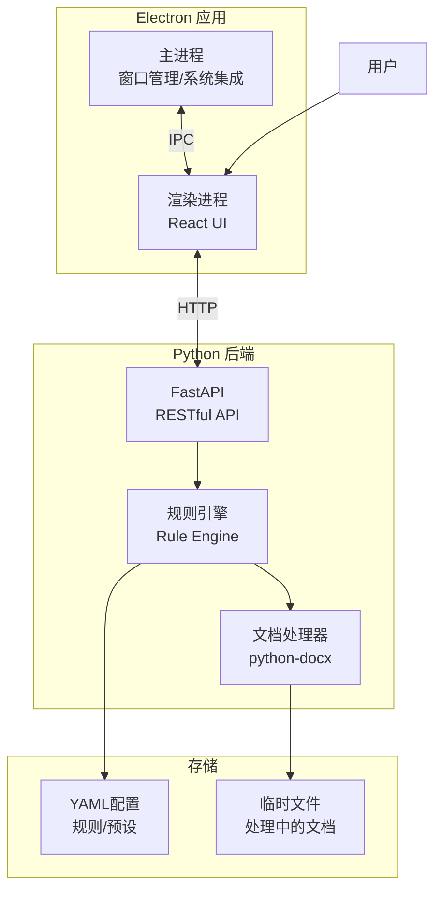
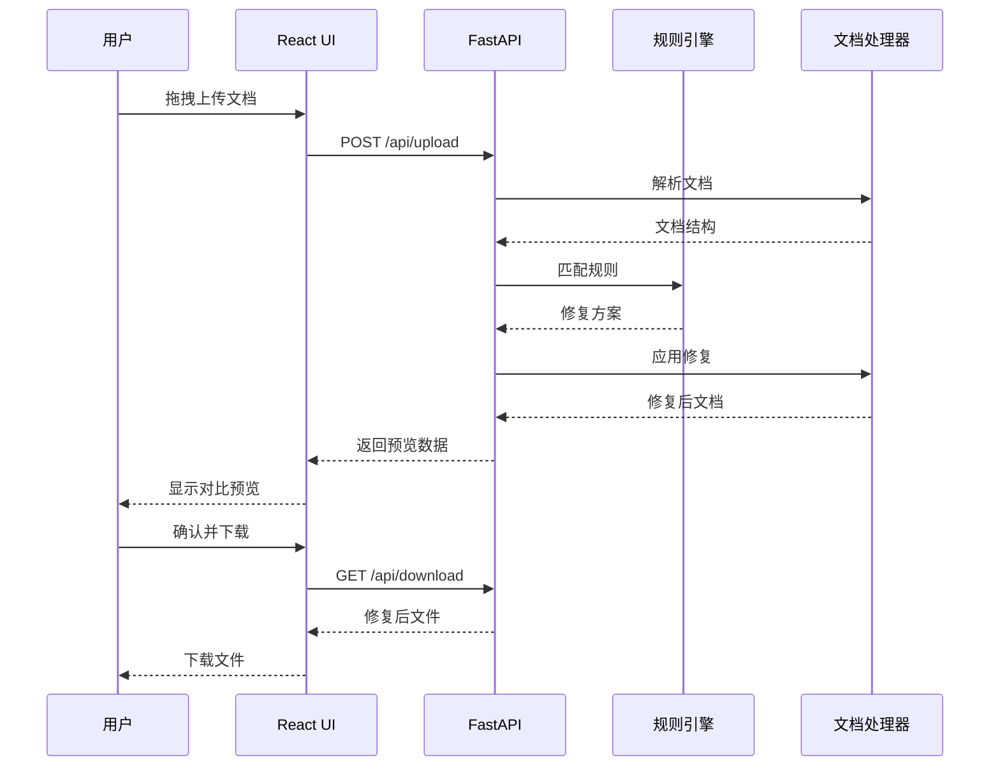

# 设计文档: Md2Docx - Word文档格式自动修复工具

**状态**: 已批准
**作者**: Md2Docx Team
**最后更新**: 2026-01-26

---

## 1. 背景与问题陈述

### 当前情况

在日常工作中，许多用户习惯使用Markdown撰写技术文档、报告和论文。当需要将这些文档转换为Word格式交付时，通常使用Pandoc进行转换。然而，转换后的Word文档经常出现以下问题：

- **表格格式混乱**：边框丢失、单元格对齐错误、表头样式不一致
- **公式渲染问题**：LaTeX公式无法正确转换为Word公式，或显示为乱码
- **标题层级错误**：标题样式不符合企业规范，编号格式不统一
- **图表问题**：图片尺寸异常、图表标题缺失、Mermaid流程图无法渲染
- **排版不规范**：行间距不统一、缩进错误、段落间距不符合规范

目前用户需要手动逐一修复这些问题，耗时耗力，且容易遗漏。

### 项目愿景

我们希望通过Md2Docx工具实现：

- **一键修复**：自动检测并修复所有格式问题
- **智能预览**：修复前后对比预览，用户可选择性应用
- **批量处理**：支持多文件并行处理，提升效率
- **规则定制**：通过YAML配置文件灵活定制修复规则

---

## 2. 目标与非目标

### 2.1 目标 (Goals)

| 优先级 | 目标                          | 验收标准                          |
| :----: | :---------------------------- | :-------------------------------- |
|   P0   | 自动修复表格边框和样式问题    | 95%以上的表格格式问题可被自动修复 |
|   P0   | 支持拖拽上传Markdown/Word文件 | 支持.md, .docx, .txt格式          |
|   P0   | 提供修复前后对比预览          | 高亮显示所有修改点                |
|   P1   | 支持LaTeX公式转Word公式       | 正确处理行内和行间公式            |
|   P1   | 批量文件处理能力              | 支持10+文件并行处理               |
|   P1   | YAML规则配置编辑器            | 语法高亮、实时验证                |
|   P2   | Mermaid图表渲染               | 流程图、时序图、类图支持          |
|   P2   | 多预设配置管理                | 企业风格、学术论文、技术博客等    |

### 2.2 非目标 (Non-Goals)

- **不做Markdown编辑器**：本项目专注于格式修复，不提供Markdown编写和预览功能
- **不做在线协作**：这是单机桌面应用，不支持多人实时协作编辑
- **不做PDF转换**：仅处理Markdown到Word的格式问题，PDF导出不在范围内
- **不做模板设计**：不提供Word模板设计工具，用户需使用第三方工具创建模板

---

## 3. 技术选型

### 3.1 核心技术栈

| 组件类别     | 选择                    | 理由                                         |
| :----------- | :---------------------- | :------------------------------------------- |
| **桌面框架** | Electron                | 跨平台支持，成熟的生态系统，便于Web技术复用  |
| **前端UI**   | React + TypeScript      | 组件化开发，类型安全，Figma原型已使用React   |
| **UI组件库** | Radix UI + Tailwind CSS | 无障碍支持，高度可定制，Figma原型已采用      |
| **后端框架** | Python + FastAPI        | 异步支持，自动API文档，便于与python-docx集成 |
| **文档处理** | python-docx             | Python最成熟的Word文档处理库                 |
| **配置格式** | YAML                    | 人类可读，便于规则配置的版本管理             |
| **进程通信** | Electron IPC + HTTP     | 主进程与渲染进程用IPC，与Python后端用HTTP    |

### 3.2 备选方案对比

| 场景     | 选择方案 | 备选方案 | 选择理由                         |
| :------- | :------- | :------- | :------------------------------- |
| 桌面框架 | Electron | Tauri    | Electron生态更成熟，开发效率更高 |
| 前端框架 | React    | Vue.js   | Figma原型已使用React             |
| 后端语言 | Python   | Node.js  | python-docx是最成熟的Word处理库  |
| 通信方式 | HTTP     | gRPC     | HTTP更简单，调试方便             |

---

## 4. 高阶架构设计

### 4.1 系统架构图

### 4.2 核心模块说明

| 模块               | 职责                                   | 关键技术             |
| :----------------- | :------------------------------------- | :------------------- |
| **Electron主进程** | 窗口管理、菜单、系统托盘、后端进程管理 | Electron API         |
| **React渲染进程**  | 用户界面、状态管理、IPC通信            | React, Zustand/Redux |
| **FastAPI服务**    | RESTful API、文件上传下载、异步任务    | FastAPI, asyncio     |
| **规则引擎**       | 规则解析、匹配、执行、优先级管理       | 自定义Python模块     |
| **文档处理器**     | Word文档解析、修改、保存               | python-docx          |

### 4.3 数据流说明

---

## 5. 功能模块设计

### 5.1 主工作台 (Workspace)

- 文件拖拽上传区域
- 格式预设快速选择
- 后端连接状态监控
- 一键修复操作按钮

### 5.2 规则编辑器 (Rule Editor)

- 规则树状分类管理
- YAML配置语法高亮编辑
- 规则实时测试功能
- 规则导入/导出

### 5.3 对比预览 (Comparison Preview)

- 左右分栏对比布局
- 修改点高亮显示
- 手动微调功能面板
- 修复摘要统计

### 5.4 批量处理 (Batch Processing)

- 文件列表表格管理
- 全局预设一键应用
- 处理进度实时监控
- 优先级和队列管理

---

## 6. 未解决的问题与开放性讨论

> [!IMPORTANT]
> 以下问题需要在开发过程中逐步明确

1. **规则冲突解决策略**：当多条规则作用于同一元素时，如何确定优先级？
2. **大文件处理**：超过50MB的Word文档如何优化处理性能？
3. **Mermaid渲染方案**：是使用Puppeteer离线渲染还是调用在线API？
4. **错误恢复机制**：修复过程中出错如何回滚并保留用户修改？
5. **版本兼容性**：如何处理不同版本Word格式的兼容问题？

---

## 7. 参考资料

- [Figma原型设计](https://www.figma.com/design/Oha7AxIGwmcB9lZ3xBGMol/Access-Project-Link)
- [python-docx文档](https://python-docx.readthedocs.io/)
- [FastAPI文档](https://fastapi.tiangolo.com/)
- [Electron文档](https://www.electronjs.org/docs)
