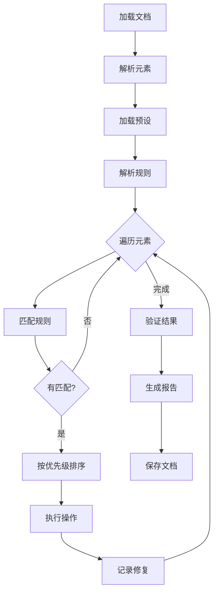

# 规则引擎设计

本文档详细描述Md2Docx的规则引擎架构、配置格式和扩展机制。

---

## 1. 设计理念

规则引擎是Md2Docx的核心，负责定义和执行文档修复逻辑。设计遵循以下原则：

| 原则 | 说明 |
|:---|:---|
| **声明式配置** | 规则使用YAML定义，无需编写代码 |
| **优先级控制** | 规则按优先级顺序执行，支持冲突解决 |
| **可组合性** | 规则可以组合成预设，满足不同场景 |
| **可测试性** | 每条规则可独立测试，确保效果正确 |
| **可扩展性** | 支持自定义规则类型和操作 |

---

## 2. 规则类型

### 2.1 表格规则 (Table Rules)

修复表格结构和样式问题：

| 规则ID | 功能 | 说明 |
|:---|:---|:---|
| `table_border_fix` | 边框修复 | 统一表格边框样式 |
| `table_header_style` | 表头样式 | 设置表头背景色和字体 |
| `table_cell_padding` | 单元格间距 | 调整单元格内边距 |
| `table_width_auto` | 宽度自适应 | 根据内容自动调整列宽 |
| `table_alignment` | 表格对齐 | 设置表格居中或左对齐 |

### 2.2 公式规则 (Formula Rules)

处理数学公式转换问题：

| 规则ID | 功能 | 说明 |
|:---|:---|:---|
| `latex_to_omml` | LaTeX转OMML | 将LaTeX公式转为Word公式 |
| `formula_numbering` | 公式编号 | 添加或修复公式编号 |
| `inline_formula_style` | 行内公式样式 | 调整行内公式字体大小 |
| `display_formula_align` | 显示公式对齐 | 居中显示公式 |

### 2.3 排版规则 (Typography Rules)

统一文档排版风格：

| 规则ID | 功能 | 说明 |
|:---|:---|:---|
| `heading_normalize` | 标题规范化 | 统一标题样式层级 |
| `paragraph_spacing` | 段落间距 | 设置段前段后间距 |
| `line_height` | 行高设置 | 调整行间距 |
| `first_line_indent` | 首行缩进 | 设置段落首行缩进 |
| `font_normalize` | 字体统一 | 替换非标准字体 |

### 2.4 图表规则 (Image Rules)

优化图片和图表显示：

| 规则ID | 功能 | 说明 |
|:---|:---|:---|
| `image_resize` | 图片尺寸 | 调整图片最大宽度 |
| `image_caption` | 图片标题 | 添加"图X"标题 |
| `image_alignment` | 图片对齐 | 居中对齐图片 |
| `mermaid_render` | Mermaid渲染 | 将Mermaid代码转为图片 |

---

## 3. YAML配置格式

### 3.1 基础结构

```yaml
# 规则元信息
id: table_border_fix
name: 表格边框修复
description: 统一表格边框样式为实线1px黑色边框
category: tables
version: 1.0.0
author: Md2Docx Team

# 规则配置
enabled: true
priority: 10  # 数字越小，优先级越高

# 选择器 - 定义规则作用的元素
selector:
  type: table
  conditions:
    - field: style.border
      operator: not_equals
      value: "1px solid #000000"

# 操作 - 定义修复动作
actions:
  - type: set_style
    params:
      border: "1px solid #000000"
      border_style: single
      border_width: 4  # 1/8磅
      border_color: "000000"

# 验证 - 定义成功条件
validation:
  check: style.border
  expected: "1px solid #000000"
```

### 3.2 选择器类型

#### 类型选择器

```yaml
selector:
  type: table  # table, paragraph, image, heading, list
```

#### 样式选择器

```yaml
selector:
  type: paragraph
  conditions:
    - field: style.name
      operator: starts_with
      value: "Heading"
```

#### 内容选择器

```yaml
selector:
  type: paragraph
  conditions:
    - field: content
      operator: contains
      value: "$$"  # 包含LaTeX公式标记
```

#### 复合选择器

```yaml
selector:
  type: table
  conditions:
    - field: rows
      operator: greater_than
      value: 1
    - field: style.border
      operator: is_null
  match_all: true  # 所有条件都满足 (AND)
```

### 3.3 操作类型

#### 设置样式

```yaml
actions:
  - type: set_style
    params:
      font_name: "宋体"
      font_size: 12
      bold: false
      color: "000000"
```

#### 添加内容

```yaml
actions:
  - type: add_content
    params:
      position: after  # before, after, replace
      content: "图 {index}"
      style: "Caption"
```

#### 替换内容

```yaml
actions:
  - type: replace_content
    params:
      pattern: "\\$\\$(.+?)\\$\\$"  # 正则表达式
      replacement: "{omml:$1}"  # 转换为OMML
```

#### 自定义函数

```yaml
actions:
  - type: custom
    handler: handle_mermaid_diagram
    params:
      output_format: png
      scale: 2
```

### 3.4 条件运算符

| 运算符 | 说明 | 示例 |
|:---|:---|:---|
| `equals` | 等于 | `value: "Heading 1"` |
| `not_equals` | 不等于 | `value: "Normal"` |
| `contains` | 包含 | `value: "$$"` |
| `not_contains` | 不包含 | `value: "TODO"` |
| `starts_with` | 开头是 | `value: "##"` |
| `ends_with` | 结尾是 | `value: ".md"` |
| `matches` | 正则匹配 | `value: "^\\d+\\."` |
| `greater_than` | 大于 | `value: 10` |
| `less_than` | 小于 | `value: 100` |
| `is_null` | 为空 | (无需value) |
| `is_not_null` | 非空 | (无需value) |

---

## 4. 预设配置

预设是一组规则的集合，用于不同文档类型：

### corporate.yaml (企业标准)

```yaml
id: corporate
name: 企业标准预设
description: 适用于商务报告、项目文档等企业场景
version: 1.0.0

# 包含的规则及其覆盖配置
rules:
  - id: table_border_fix
    enabled: true
    overrides:
      params:
        border_width: 4
        
  - id: heading_normalize
    enabled: true
    overrides:
      params:
        h1_size: 22
        h2_size: 16
        h3_size: 14
        
  - id: paragraph_spacing
    enabled: true
    overrides:
      params:
        before: 0
        after: 12
        line_spacing: 1.5
        
  - id: font_normalize
    enabled: true
    overrides:
      params:
        default_font: "微软雅黑"
        heading_font: "黑体"
```

### academic.yaml (学术论文)

```yaml
id: academic
name: 学术论文预设 (APA 7)
description: 符合APA第7版规范的学术论文格式
version: 1.0.0

rules:
  - id: heading_normalize
    overrides:
      params:
        h1_size: 14
        h1_bold: true
        h1_centered: true
        
  - id: formula_numbering
    enabled: true
    overrides:
      params:
        format: "({chapter}.{number})"
        position: right
        
  - id: paragraph_spacing
    overrides:
      params:
        line_spacing: 2.0
        first_indent: 0.5  # 英寸
```

---

## 5. 执行流程



### 5.1 规则解析阶段

```python
class RuleParser:
    def parse(self, yaml_content: str) -> Rule:
        """解析YAML配置为Rule对象"""
        data = yaml.safe_load(yaml_content)
        
        return Rule(
            id=data['id'],
            name=data['name'],
            category=data['category'],
            enabled=data.get('enabled', True),
            priority=data.get('priority', 100),
            selector=self._parse_selector(data['selector']),
            actions=self._parse_actions(data['actions']),
            validation=self._parse_validation(data.get('validation')),
        )
```

### 5.2 规则匹配阶段

```python
class RuleMatcher:
    def match(self, element: Element, rules: List[Rule]) -> List[Rule]:
        """找出适用于元素的所有规则"""
        matched = []
        
        for rule in rules:
            if not rule.enabled:
                continue
            
            if self._selector_matches(rule.selector, element):
                matched.append(rule)
        
        # 按优先级排序
        return sorted(matched, key=lambda r: r.priority)
```

### 5.3 规则执行阶段

```python
class RuleExecutor:
    def execute(
        self,
        element: Element,
        rules: List[Rule],
        doc: Document,
    ) -> List[Fix]:
        """执行匹配的规则"""
        fixes = []
        
        for rule in rules:
            before_state = self._capture_state(element)
            
            for action in rule.actions:
                handler = self._get_action_handler(action.type)
                handler.execute(element, action.params, doc)
            
            after_state = self._capture_state(element)
            
            fixes.append(Fix(
                rule_id=rule.id,
                element_id=element.id,
                before=before_state,
                after=after_state,
                description=rule.name,
            ))
        
        return fixes
```

---

## 6. 冲突解决

当多条规则作用于同一元素时，按以下策略解决：

### 6.1 优先级策略

```yaml
# 规则优先级：数字越小，优先级越高
priority: 10   # 最先执行
priority: 100  # 默认优先级
priority: 999  # 最后执行
```

### 6.2 覆盖策略

预设可以覆盖规则的默认配置：

```yaml
rules:
  - id: table_border_fix
    overrides:
      priority: 5  # 覆盖默认优先级
      params:
        border_color: "333333"  # 覆盖默认参数
```

### 6.3 互斥规则

某些规则可能互斥，需要声明：

```yaml
id: font_to_simsun
conflicts:
  - font_to_microsoft_yahei
  - font_to_kaiti
```

---

## 7. 自定义规则开发

### 7.1 注册自定义操作

```python
from engine.executor import ActionHandler, register_action

@register_action("render_mermaid")
class MermaidRenderHandler(ActionHandler):
    """Mermaid图表渲染处理器"""
    
    async def execute(
        self,
        element: Element,
        params: Dict[str, Any],
        doc: Document,
    ):
        mermaid_code = element.content
        image_path = await self._render_to_image(mermaid_code, params)
        self._replace_with_image(element, image_path, doc)
```

### 7.2 注册自定义选择器

```python
from engine.matcher import SelectorHandler, register_selector

@register_selector("has_track_changes")
class TrackChangesSelector(SelectorHandler):
    """选择包含修订的元素"""
    
    def matches(self, element: Element, conditions: Dict) -> bool:
        return element.has_revision_marks
```

---

## 8. 规则测试

### 8.1 单元测试

```python
import pytest
from engine.parser import RuleParser
from engine.matcher import RuleMatcher
from core.document import DocumentParser

def test_table_border_rule():
    """测试表格边框规则"""
    # 加载规则
    parser = RuleParser()
    rule = parser.load("rules/tables/border_fix.yaml")
    
    # 创建测试文档
    doc = create_test_doc_with_borderless_table()
    elements = DocumentParser(doc).parse()
    
    # 执行匹配
    matcher = RuleMatcher()
    matched = matcher.match(elements[0], [rule])
    
    assert len(matched) == 1
    assert matched[0].id == "table_border_fix"
```

### 8.2 交互式测试

在规则编辑器中提供实时测试功能：

```typescript
// 前端调用测试API
const testResult = await api.testRule({
  ruleConfig: yamlContent,
  sampleContent: "| A | B |\n|---|---|\n| 1 | 2 |",
});

// 显示修复前后对比
console.log(testResult.before);
console.log(testResult.after);
console.log(testResult.fixes);
```

---

## 9. 内置规则参考

### rules/tables.yaml

```yaml
# 表格边框修复规则集
rules:
  - id: table_border_standard
    name: 标准表格边框
    description: 应用1px实线黑色边框
    priority: 10
    selector:
      type: table
    actions:
      - type: set_style
        params:
          border: all
          border_style: single
          border_width: 4
          border_color: "000000"

  - id: table_header_style
    name: 表头样式
    description: 设置首行为表头样式
    priority: 20
    selector:
      type: table
      conditions:
        - field: rows
          operator: greater_than
          value: 1
    actions:
      - type: set_row_style
        params:
          row_index: 0
          background: "f0f0f0"
          font_bold: true
```

### rules/typography.yaml

```yaml
# 排版规则集
rules:
  - id: heading_1_style
    name: 一级标题样式
    priority: 10
    selector:
      type: paragraph
      conditions:
        - field: style.name
          operator: equals
          value: "Heading 1"
    actions:
      - type: set_style
        params:
          font_name: "黑体"
          font_size: 22
          bold: true
          spacing_before: 24
          spacing_after: 12

  - id: body_text_style
    name: 正文样式
    priority: 50
    selector:
      type: paragraph
      conditions:
        - field: style.name
          operator: equals
          value: "Normal"
    actions:
      - type: set_style
        params:
          font_name: "宋体"
          font_size: 12
          line_spacing: 1.5
          first_line_indent: 24  # 2字符
```
