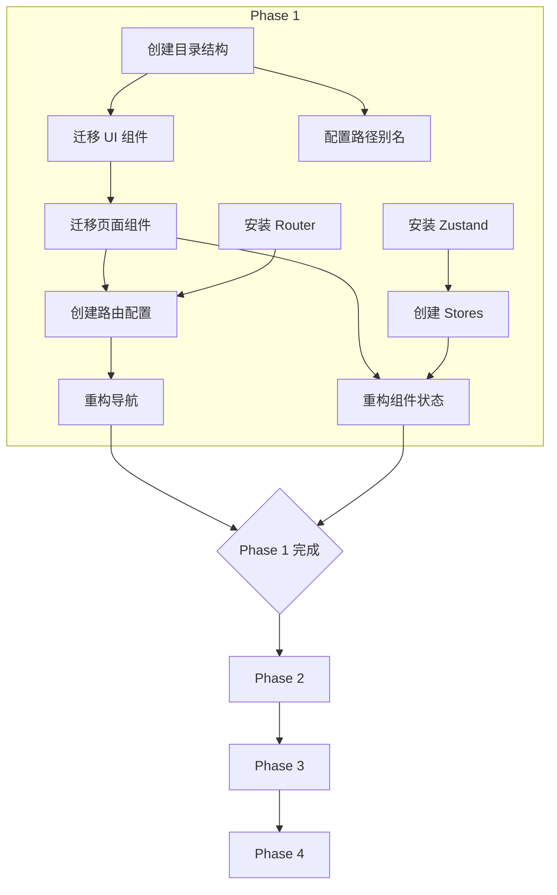

# 综合执行方案：前端框架搭建

**创建日期：** 2026-01-26  
**关联规格：** [REQ-001-前端框架搭建](../requirements/REQ-001-前端框架搭建.md)  
**状态：** 执行中

---

## 1. 方案概述与架构假设

### 核心架构决策

| 决策点 | 选择 | 理由 |
|:---|:---|:---|
| 目录结构 | 按功能领域划分 | React 社区最佳实践 |
| 状态管理 | Zustand | 轻量、TS 友好 |
| 路由方案 | React Router v6 | 数据路由模式 |
| Electron 架构 | 主进程/渲染进程分离 | 安全性最佳实践 |
| 后端通信 | HTTP REST | 与 FastAPI 兼容 |

### 技术栈

React 18 + TypeScript + Vite 6 + Tailwind CSS 4 + Radix UI + Zustand + React Router v6 + Electron

---

## 2. 任务依赖关系



---

## 3. 测试计划

| AC | 测试用例 | 类型 | 预期结果 |
|:---|:---|:---|:---|
| AC-01 | TC-P1-001 | 静态检查 | 目录结构符合规范 |
| AC-02 | TC-P1-002 | E2E | 路由切换正常 |
| AC-03 | TC-P1-003 | 集成测试 | 状态跨组件共享 |
| AC-04 | TC-P1-004 | 烟雾测试 | 浏览器运行无错误 |

---

## 4. 回滚预案

```bash
# 回滚到指定提交
git log --oneline -10
git reset --hard <commit-hash>
npm ci
```

**触发条件：** 验证测试失败 ≥ 2 项关键用例
